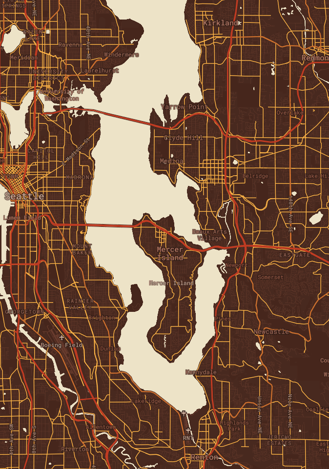

# Map Tilesets - GEOG 458 Lab 4

These tilesets go over the Puget Sound region in Washington. The data layer uses bus stop data from [King County GIS Open Data](https://gis-kingcounty.opendata.arcgis.com/datasets/transit-stops-for-king-county-metro-transitstop-point). I wanted to map out bus stop data because I primarily traveled via transit throughout the Puget Sound pre-COVID. These map tiles give an idea of the region that I traveled throughout my early university years.

[Link to map](https://jcorille-21.github.io/map_tilesets/)
*By Jerome Orille | Winter 2021*

## Tile 1 - Basemap

- This is a modified basemap that has an emphasis on the primary, secondary and tertiary roads surrounding Puget Sound. Font used is Roboto Mono.
- The area is focused in on the Puget Sound region.
- Min zoom of 10
- Max zoom of 14

## Tile 2 - Puget Sound Bus Stop Data

- This is a data layer that shows the bus stops surrounding the Puget Sound region. Font used is Roboto Mono
- The area is focused in on the Puget Sound region.
- Min zoom of 10
- Max zoom of 14

## Tile 3 - Puget Sound Bus Stops With Basemap

- This uses the data layer containing bus stops and a modified basemap to show the bus stops around Puget Sound. Font used is Roboto Mono.
- The area is focused in on the Puget Sound region.
- Min zoom of 10
- Max zoom of 14

## Tile 4 - Autumn Theme

- This is a thematic map with an autumn theme. Autumn is my favorite season, so I chose to include its colors. Font used is Roboto Mono.
- The area is focused in on the Puget Sound region.
- Min zoom of 10
- Max zoom of 14
